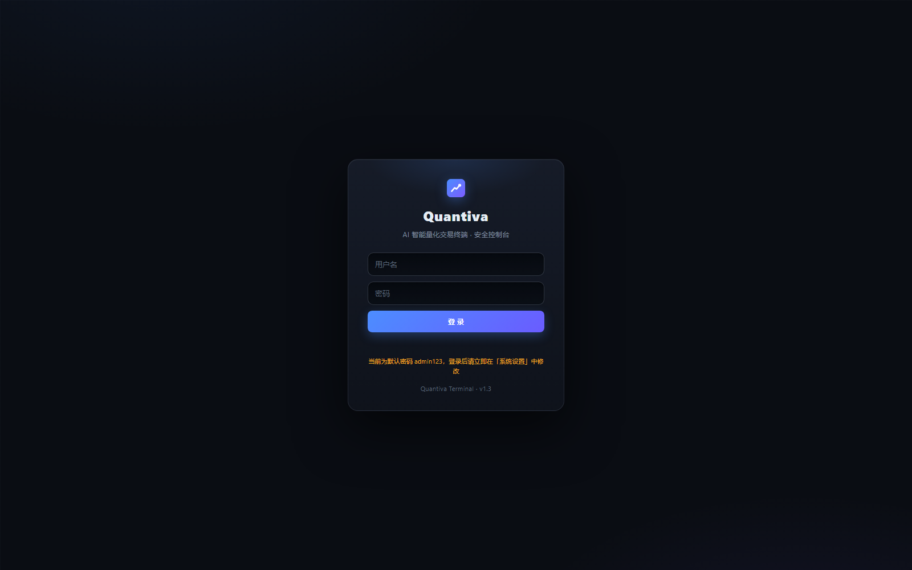
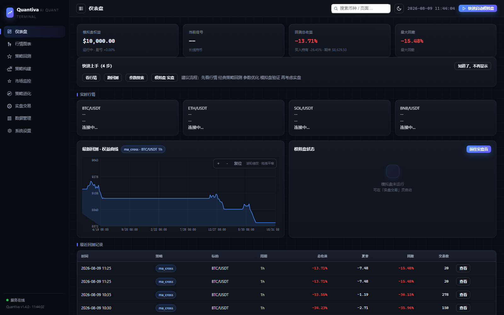
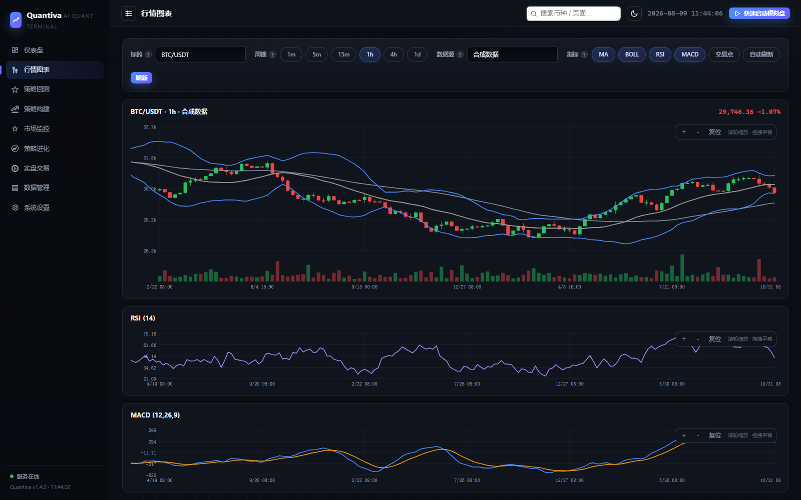
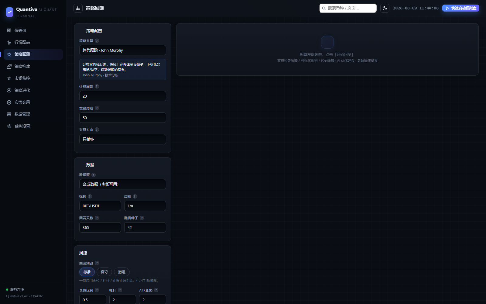

# Quantiva · AI 加密货币量化交易终端


> 当前版本：**v1.4.0**（2026-08-09）｜[更新日志](CHANGELOG.md)

一个模块化、可正式上线部署的加密货币量化交易系统（Python 3.12 + ccxt + FastAPI + pandas）。
覆盖 **数据抓取 → 指标计算 → 经典/自定义策略 → 回测 → 深度分析 → AI 优化 → 市场监控 → 模拟/实盘 → 飞书推送 → 策略进化 → 生产部署** 的完整闭环。

> ⚠️ **免责声明**：本项目仅用于学习与研究，不构成任何投资建议。加密货币交易风险极高，实盘前请务必用模拟盘充分验证，风险自担。

---

## 📥 下载与安装

**方式一：直接下载 ZIP（无需 Git）**
- 仓库首页 → 绿色 `Code` 按钮 → `Download ZIP` → 解压即可
- 或下载最新 Release 源码包：[Releases](https://github.com/Tazz-zhu/quantiva/releases)（tar.gz / zip，含对应版本源码）

**方式二：Git 克隆**
```powershell
git clone https://github.com/Tazz-zhu/quantiva.git
cd quantiva
```

**方式三：Docker（推荐服务器部署）**
```bash
cp .env.example .env   # 按需填写密钥
docker compose up -d --build
```

**快速开始**
```powershell
pip install -r requirements.txt
python scripts/webui.py        # 打开 http://127.0.0.1:8686
```

> 默认账号 `admin` / `admin123`，登录后请在「系统设置」中立即修改密码。离线环境选择「合成数据」即可完整演示全部功能。

## 🖼 界面预览

登录页 | 仪表盘
--- | ---
 | 

行情图表 | 策略回测
--- | ---
 | 

> 🌐 在线文档站：[tazz-zhu.github.io/quantiva](https://tazz-zhu.github.io/quantiva)

## 🖥️ Web 控制台

```powershell
python scripts/webui.py          # 启动并自动打开浏览器 http://127.0.0.1:8686
python scripts/webui.py --prod   # 生产模式（0.0.0.0，不自动开浏览器）
```

**默认账号**：`admin` / `admin123`（登录后请在「系统设置 → 安全与运维」立即修改密码）

| 页面 | 功能 |
| --- | --- |
| 仪表盘 | 实时行情、账户权益、当前信号、最新回测摘要、回测记录 |
| 行情图表 | TradingView 蜡烛图，MA/BOLL/RSI/MACD 叠加、买卖点标注 |
| 策略回测 | 经典策略库 + 自定义规则 → 指标卡片 + 权益/回撤曲线 + 交易明细 + 深度分析 + AI 建议 + HTML 报告 |
| 策略构建 | 可视化多指标规则组合 + 🧑‍💻 代码策略（TradingView 风格 Python 编辑器，语法高亮） |
| 市场监控 | 32 币种实时监控 + 动态榜单（成交量/涨幅/跌幅 TOP10）+ 异动检测，24h 常驻 |
| 策略进化 | 参数网格搜索自我迭代、交易持久化、定时分析、经验沉淀到迭代日志 |
| 实盘交易 | 模拟盘/实盘启停、杠杆、止损止盈实时监控、持仓/成交/事件日志 |
| 数据管理 | 抓取行情入库（合成/真实）、本地数据库统计 |
| 系统设置 | 交易所 / AI / 飞书 / 安全运维 / 审计日志 / 交易成本 |

> **离线优先**：无法直连交易所时选择「合成数据」即可完整演示全部功能。

---

## 📚 经典策略库（各流派大师策略）

| 策略 | 流派 | 代表人物 |
| --- | --- | --- |
| 海龟交易法则 | 趋势跟踪 | Richard Dennis |
| 双均线交叉 | 趋势跟踪 | John Murphy |
| MACD 金叉死叉 | 趋势/动量 | Gerald Appel |
| 动量突破 | 动量交易 | Mark Minervini |
| 布林带回归 | 均值回归 | John Bollinger |
| RSI 超买超卖 | 均值回归 | Welles Wilder |
| 区间网格 | 震荡网格 | Swing Trading |
| 三重滤网 | 多重滤网 | Alexander Elder |
| 🧑‍💻 代码策略 | TradingView 风格 | Python（Pine Script 替代） |
| 自定义规则 | 自定义 | 用户 |

---

## 🌐 网络与运行环境要求

| 功能 | 依赖的网络 | 离线可用 | 说明 |
| --- | --- | --- | --- |
| Web 控制台 | 仅本机 127.0.0.1 | ✅ | 无外网依赖 |
| 回测 / 策略 / 分析 | 无（或交易所行情） | ✅（合成数据） | 真实行情需交易所 API |
| 市场监控 | 交易所行情 | ✅（合成数据） | source: synthetic 可离线演示 |
| 模拟盘（paper） | 行情源 | ✅（合成数据） | source: exchange 时需交易所可达 |
| 实盘交易 | **OKX 等交易所 API** | ❌ | 需可访问 www.okx.com / api.okx.com |
| AI 优化建议 | **DeepSeek / OpenAI API** | ❌ | 默认 DeepSeek：api.deepseek.com（国内直连） |
| 飞书推送 | 飞书 Webhook | ❌ | open.feishu.cn（国内直连） |

**推荐环境（按省心程度）：**
1. **海外 VPS / 服务器**（香港 / 新加坡 / 美西）：所有 API 直连，OKX + DeepSeek + 飞书全部可用，配合 Docker 部署最稳定；
2. **国内服务器 / 本机**：DeepSeek、飞书直连可用；**OKX 需代理**（设置 `HTTPS_PROXY` 环境变量，或 ccxt `proxies` 参数）；
3. **完全离线**：关闭监控真实行情与实盘，用「合成数据」可完整演示回测 / 策略 / 进化 / 模拟盘。

**防火墙白名单（只需 443 出站）：** `www.okx.com`、`api.okx.com`、`aws.okx.com`（OKX）；`api.deepseek.com`（DeepSeek）；`open.feishu.cn`（飞书）；若用 OpenAI 需 `api.openai.com`。

**OKX + DeepSeek 快速配置：**
```yaml
# config/config.yaml
exchange:
  id: okx          # binance -> okx
  sandbox: false   # true = OKX 模拟盘（demo trading）
ai:
  enabled: true
  api_key_env: DEEPSEEK_API_KEY
  base_url: https://api.deepseek.com/v1
  model: deepseek-chat
```
环境变量：`CCXT_API_KEY` / `CCXT_API_SECRET` / `CCXT_API_PASSPHRASE`（OKX API v5 必须含口令）、`DEEPSEEK_API_KEY`。
也可以把密钥写入项目根目录 `.env`（参考 `.env.example`），启动时会自动加载（不会覆盖系统环境变量）。

---

## 📁 项目结构

```
quantiva/
├── quant/                  # 核心 Python 包
│   ├── backtest/           # 回测引擎（信号执行/止损/强平/资金费率）
│   ├── strategy/           # 策略库（经典 8 种 + 代码/自定义规则）
│   ├── risk/               # 风控模型（风险预算/移动止损/熔断）
│   ├── analytics/          # 绩效指标（夏普/VaR/R倍数/Alpha-Beta）
│   ├── evolution/          # 参数优化（网格搜索 + 样本外验证）
│   ├── monitor/            # 市场监控（异动/波动率突增告警）
│   ├── execution/          # 执行器（模拟盘/真实交易所 + 执行质量）
│   ├── web/                # FastAPI 服务、会话、审计、SSE
│   └── notify/             # 飞书推送
├── webui/                  # 前端（原生 JS + 自绘 SVG 图表，无构建步骤）
├── config/config.yaml      # 配置文件（默认值，密钥走环境变量）
├── deploy/                 # Docker / systemd / HTTPS 部署脚本
├── scripts/                # 启动与工具脚本
├── tests/                  # 单元测试（40+）
└── docs                    优化清单：PRODUCT / QUANT / UI_OPTIMIZATIONS.md
```

## 🤝 参与贡献

- [贡献指南](CONTRIBUTING.md) ｜ [安全说明](SECURITY.md) ｜ [行为准则](CODE_OF_CONDUCT.md)
- [更新日志](CHANGELOG.md) ｜ 开源协议：[MIT](LICENSE)

## 🚀 生产部署

### 安全须知（首次部署必读）
- 默认开启访问认证（admin / admin123），请**立即修改密码**（自动哈希存储）；
- API 密钥通过环境变量注入：`CCXT_API_KEY` / `CCXT_API_SECRET` / `OPENAI_API_KEY` / `FEISHU_WEBHOOK`；
- 配置敏感字段在界面自动脱敏。

### 方式一：Docker（推荐服务器）
```bash
cp .env.example .env   # 填写密钥
docker compose up -d --build
docker compose logs -f quantumx
```
数据经 Volume 持久化，内置健康检查与自动重启。

### 方式二：systemd（Linux）
```bash
sudo cp deploy/quantumx.service /etc/systemd/system/
sudo systemctl enable --now quantumx
```

### 方式三：Windows
```powershell
start.bat                                  # 开发模式
python scripts/webui.py --prod --port 8686 # 生产模式
```

### HTTPS 证书自动化
```bash
# Let's Encrypt 一键（Linux + Nginx）
sudo bash deploy/scripts/setup_https.sh your.domain.com

# 自签名证书（内网/测试）
python scripts/gen_self_signed_cert.py --host 127.0.0.1,localhost --out data/tls
python scripts/webui.py --ssl-certfile data/tls/server.crt --ssl-keyfile data/tls/server.key
```
Nginx 完整 HTTPS 模板见 `deploy/nginx.conf.example`。

### 多节点部署（角色分离）
```bash
QUANTX_ROLE=monitor QUANTX_NODE_ID=monitor-1 python scripts/webui.py --prod   # 行情监控
QUANTX_ROLE=trader  QUANTX_NODE_ID=trader-1  python scripts/webui.py --prod --port 8687  # 交易
QUANTX_ROLE=web     QUANTX_NODE_ID=web-1     python scripts/webui.py --prod   # 控制台
```
一键多节点：`docker compose -f docker-compose.multi.yml up -d --build`。
> 多节点共享 data/ 需网络存储；SQLite 不适合跨节点并发写，高并发请迁移 PostgreSQL。

### 运维能力
| 能力 | 说明 |
| --- | --- |
| 文件日志 | `data/logs/quantx.log`（5MB 轮转 × 5 份） |
| 自动备份 | 每 24h 备份数据库到 `data/backups/`，保留 7 份 |
| 操作审计 | 登录/改密/配置/回测/实盘/优化/备份全记录（用户/IP/结果），设置页可视化 |
| 健康检查 | `GET /api/health` |
| 系统状态 | 版本/节点/运行时长/数据库大小/日志大小 |

---

## 🔧 配置（config/config.yaml）
| 配置项 | 说明 |
| --- | --- |
| `exchange.id` | ccxt 交易所：binance / okx / bybit / gateio / bitget… |
| `strategy.name` / `params` | 默认策略与参数 |
| `risk.*` | 仓位/杠杆/止损止盈/ATR止损/单笔风险预算/移动止损/保本/日亏损熔断/回撤熔断/实盘二次确认 |
| `backtest.*` | 初始资金 / 手续费 / 滑点 / 8h 资金费率 |
| `ai.*` | AI 建议：enabled / api_key_env / base_url / model |
| `monitor.*` | 监控：enabled / interval / symbols / thresholds |
| `notify.feishu.*` | 飞书：enabled / webhook / secret；on_trade / on_alert |
| `evolution.*` | 进化：db_path / auto_analyze / save_trades |
| `auth.*` | 认证：enabled / username / password_hash |
| `system.*` | 数据目录 / 日志目录 / 备份策略 |
| `deployment.*` | 节点角色 / 节点 ID |

---

## 🧪 测试
```powershell
python -m unittest discover -s tests
```

---

## 已知限制与扩展方向
- 单标的单仓位；实盘/监控已支持 SSE 实时推送（自动回退轮询）；
- 多节点并发写需 PostgreSQL；
- 可扩展：多标的组合、策略自动部署闭环。

---

## 📌 更新日志

### v1.4.0（2026-08-09）· 用户体验优化（用户视角 20 条）
- 🧯 实盘页「一键平仓」+ 持仓入场价/浮动盈亏展示
- 🔔 浏览器通知（监控异动 / 回测完成 / 进化完成）+ 监控未读红点，可在设置页关闭
- 🔍 顶栏全局快速搜索（页面 + 币种直达行情）
- 📈 行情图表支持任意币种输入 + 自动刷新开关；仪表盘行情卡点击直达
- ↻ 回测历史「重跑」、结果「复制摘要」、参数模板保存/载入
- 🌗 主题三态（深色 / 浅色 / 跟随系统）；登录记住用户名
- 📤 审计日志 / 监控事件 CSV 导出；设置页「恢复默认配置」
- ⬆ 回到顶部按钮、Logo 回首页、标签页标题跟随、时区显示、大任务提示

### v1.3.3（2026-08-09）· 修复监控页闪烁
- 🩹 市场监控页由「整表重建」改为「增量更新」：行情表逐单元格更新、榜单原地刷新、事件流去重插入
- 📏 事件流容器固定高度滚动，消除实时插入导致的布局抖动

### v1.3.2（2026-08-09）· 移动端适配
- 📱 移动端侧栏抽屉化：默认隐藏、按钮呼出、遮罩点击关闭、导航后自动收起
- 📐 表单页 side-panel 修复小屏溢出（min-width 修复）
- 🎛 顶栏手机端隐藏「快速启动模拟盘」按钮，避免拥挤
- 🔤 登录卡片小屏 max-width 兜底；输入行/指标格/图表高度按 720/520/420 三档断点适配

### v1.3.1（2026-08-09）· 主题切换 / 图表配色 / 可折叠侧栏
- 🌗 深色 / 浅色主题一键切换：顶栏按钮，localStorage 持久化，加载前预置避免闪烁
- 🎨 图表配色升级：全部改为 CSS 变量驱动（涨跌色/网格/文字/多系列色板），随主题自动切换并重绘
- 📐 侧栏可折叠：顶栏按钮切换为图标栏，持久化记忆，窄屏自动适配

### v1.3.0（2026-08-09）· 高级 UI 设计系统
- 🎨 全新设计系统：分层深色质感 + 蓝紫品牌渐变 + 背景网格/光晕
- 🔤 排版精修：数字等宽（tnum）、标题/标签字距统一、统计数字强化
- 🧊 表面质感：卡片内高光、侧栏/顶栏/弹窗/Toast 毛玻璃、悬浮上移反馈
- 🧭 侧边导航高级化：图标容器、激活渐变胶囊 + 指示条
- 🔑 登录页品牌化：渐变网格背景、卡片辉光、版本标签
- 📊 表格/徽章/表单精修：渐变表头、胶囊徽章、输入光晕、隐藏数字箭头
- ✨ 动效与无障碍：页面淡入、弹窗/遮罩入场动画、全局 focus-visible、Toast 类型色条
- 📱 响应式：新增 900/720 断点，窄屏侧栏收为图标栏

### v1.2.0（2026-08-09）· 量化风控与绩效体系
- 📊 新增滚动稳定性分析（滚动夏普/波动/回撤 + 曲线图）
- ⚡ 实盘执行质量统计（成交率 / 平均滑点 bps / 平均延迟 ms / 拒单数）
- 📐 修正 Sortino / 下行偏差计算（标准 Downside Deviation）
- 🎯 单笔风险预算仓位（risk_per_trade_pct）：按止损距离自动计算仓位
- 🛡 新增 ATR/固定% 移动止损与保本止损（回测+实盘统一）
- 🔄 修复止损触发同 bar 立即重入；新增杠杆强平（margin_call）
- ⛔ 实盘新增组合权益回撤熔断（max_drawdown_pct）；修复实盘 start_equity
- 📊 指标体系扩展：VaR95/CVaR95、下行波动率、Ulcer、水下时间、尾部比率、平均盈亏比、最佳/最差日、Alpha/Beta/超额收益、R 倍数
- 🧪 参数优化新增样本外验证（holdout）、最小交易数过滤、Calmar/SQN 目标与过拟合警示
- 💰 回测新增成本敏感性压力测试（0.5x / 2x 手续费滑点）
- 🌊 监控新增波动率突增告警；数据管理新增缺失率与新鲜度
- 📈 前端：回测页新增风控参数与量化指标、成本敏感性表；进化页新增样本外验证配置

### v1.1.1（2026-08-09）· 实时推送 / 策略对比 / 会话恢复
- ⚡ **SSE 实时推送**：实盘页与监控页改为服务端推送（约 2s 间隔），断线自动回退轮询
- 🔁 **多策略同图对比**：回测页「多策略同图对比」，2-4 个策略并行回测、权益曲线同图 + 指标对比表
- 💾 **实盘会话持久化**：启动自动保存 data/live_session.json，重启后一键恢复或清除；实盘恢复需二次确认
- 🧪 新增回归测试（资金费率 / Token 吊销 / 监控筛选 / 分页抓取 / 对比任务 / 会话读写）

### v1.1.0（2026-08-09）· 产品体验与风控强化
- 🛠 修复：设置页「保存全部配置」失效（新增 `POST /api/config`）
- 📥 数据抓取支持分页，完整拉取指定天数历史 K 线
- 🛡 实盘启动增加二次确认（弹窗 + 输入 CONFIRM，可配置关闭）
- ⛔ 实盘/模拟盘新增**日亏损熔断**（`risk.max_daily_loss_pct`，次日 UTC 0 点复位）
- 🔐 登录失败 5 次锁定 15 分钟；修改密码后吊销全部旧会话
- ⚠️ 默认密码全局警示条，引导立即修改
- 📊 监控事件支持类型筛选 + 分页加载
- 🗑 数据管理支持删除本地数据集
- 📄 回测/进化交易明细支持 CSV 导出（Excel 可直接打开）
- 💸 回测新增永续合约 8h 资金费率模拟（`backtest.funding_rate_8h`）
- 🖱 行情图表新增十字光标 + OHLC 数值浮层
- 🚀 仪表盘新增快速上手引导、买入持有对照、错误状态提示
- ⚠️ 前端页面错误不再静默，统一可见化提示

完整 20 条产品优化清单见 [PRODUCT_OPTIMIZATIONS.md](PRODUCT_OPTIMIZATIONS.md)。
